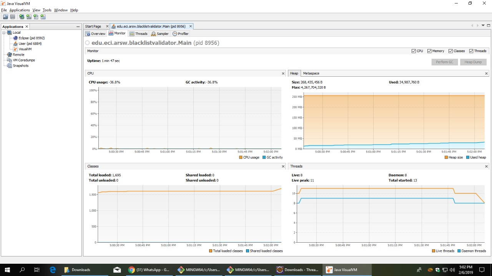
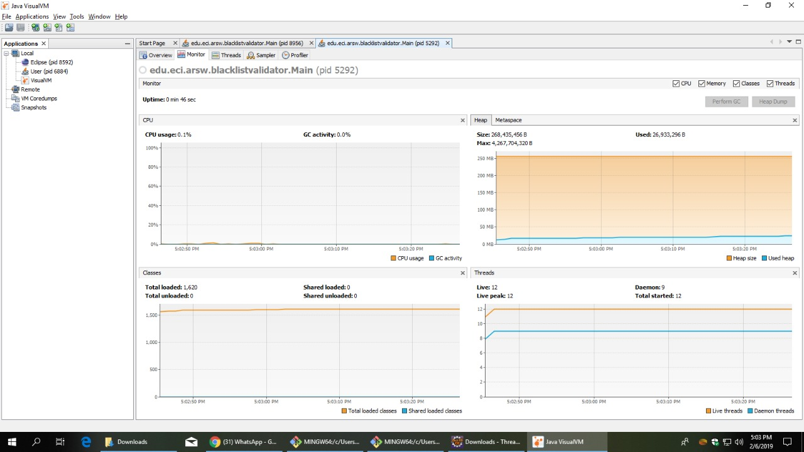
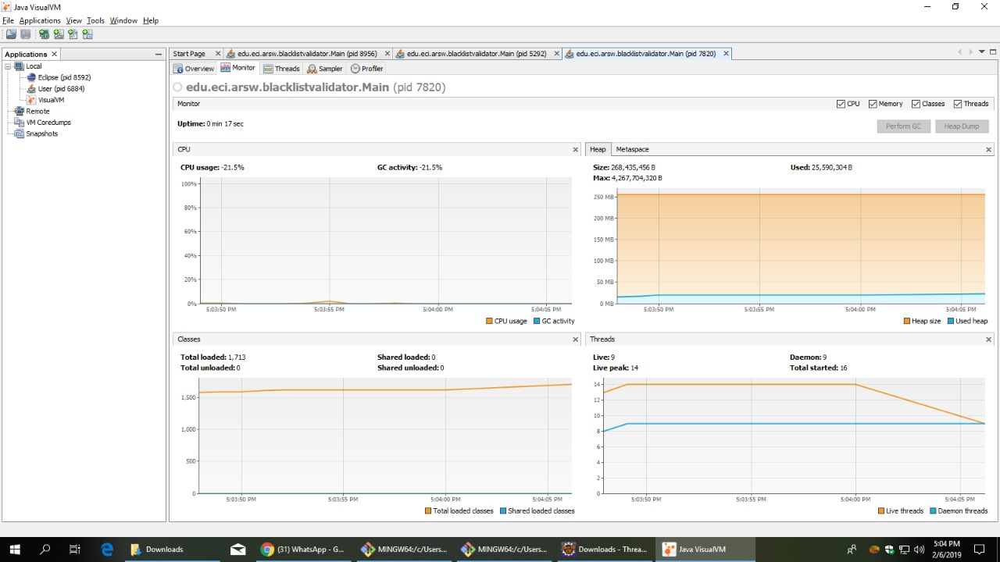

# lab 3 

## Black List Search

### Part I - Introduction to threads in JAVA
In this exercise i create a simple lifecycle from a thread when i use a loop to read the parameters then i the code print each number in the sequence tha arrives; when i execute the threads using `start()` method  the sequence of the numbers dont have a particular order but when i use `run();` method  the number are print in the expected order.
The diference between `run();` and `start();`is that run(); directly, it runs on the call thread, and start(); create a new thread instance.

### Part II - Black List Search Exercise

When i undertand this exercise i could modify the `HostBlackListsValidator` class  them i create the threads using the parameter given by constructor, after the threads are built and started in a loop and then, when the loop in end y use the `join()` method and  every thread for them to wait until all threads are done working.

### Part III - Discussion

To make things more efficient, a controller must have  synchronized all the variables that are shared between threads

### Part IV - Performance Evaluation

#### One thread

#### two threads

#### Four threads

#### Eight threads

## Snake Race

### Part I - Prime Finder
In this part i modify a control class and i put in the `run();` method a funtion that wait all the primes and calculate the size of the list, then i put a wait in the `PrimeFinderThread` class that funtion for stop the threads a wait that the next primes are calculate, then i put a notify for the threads are unlock.
### Part 3

 - Possible race conditions
	 - 	That two sankes find the same mouse at the same time.
	-	That two snakes find the same power at the same time.
 - when i increase the game speeed  the progam generate a error because the snakes are accessing toa list at the same time that want delete them. 
 - To create more race conditions i  synchronized all the body when the snake is draw.
 - i modify the project a put the required funtions and the game funtion of  the correct way.
